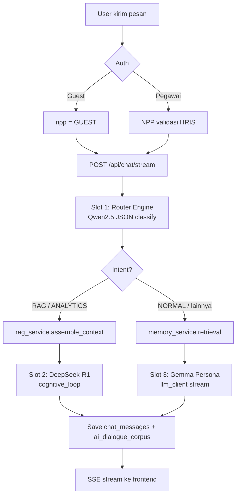
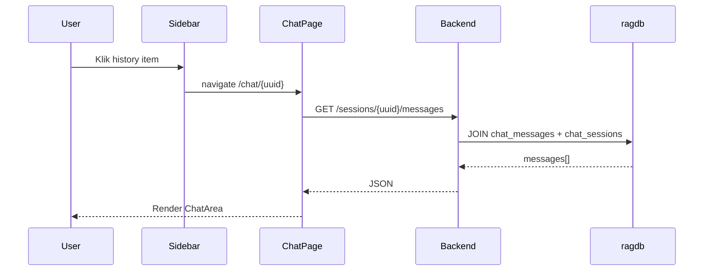

# CAKRA AI RAG System

**CAKRA AI** (*Cerdas, Adaptif, Konstruktif, Responsif, Analitik*) adalah sistem asisten inteligen enterprise untuk **PT Pindad** yang dirancang **bukan sebagai chatbot generik**, melainkan platform kognitif dengan:

- **Three-Engine Architecture** — routing intent otomatis ke model yang tepat
- **RAG dokumen internal** — SOP, IK, SKEP, regulasi pabrik
- **Memori jangka panjang** — AI mengingat konteks pegawai lintas sesi
- **Empati & sentimen** — respons menyesuaikan emosi user
- **Reasoning mendalam** — DeepSeek-R1 untuk analitik & dokumen
- **Self-learning foundation** — korpus dialog & tabel learning siap dikembangkan

---

## Daftar Isi

1. [Arsitektur Sistem](#arsitektur-sistem)
2. [Flow Diagram](#flow-diagram)
3. [Model AI (Three-Engine)](#model-ai-three-engine)
4. [Fitur yang Sudah Ada](#fitur-yang-sudah-ada)
5. [Struktur Folder](#struktur-folder)
6. [API Endpoints](#api-endpoints)
7. [Frontend Routes](#frontend-routes)
8. [Database](#database)
9. [Cara Menjalankan](#cara-menjalankan)
10. [Dokumentasi Lanjutan](#dokumentasi-lanjutan)

---

## Arsitektur Sistem

```text
┌─────────────────────────────────────────────────────────────────────────┐
│                         pinAi/ (Monorepo)                               │
├──────────────────────────────┬──────────────────────────────────────────┤
│   webui/ (React + Vite)      │   backend/ (FastAPI + asyncpg)           │
│   Port: 5173                 │   Port: 5000                             │
│   Zustand state              │   Ollama LLM (localhost:11434)           │
└──────────────────────────────┴──────────────────────────────────────────┘
                                        │
                    ┌───────────────────┴───────────────────┐
                    ▼                                       ▼
            ┌──────────────┐                        ┌──────────────┐
            │   ragdb      │                        │   hris_db    │
            │ (PostgreSQL  │                        │ (PostgreSQL  │
            │  + pgvector) │                        │  remote HRIS)│
            └──────────────┘                        └──────────────┘
```

### Komponen Utama

| Layer | Teknologi | Peran |
|-------|-----------|-------|
| Frontend | React 18, Vite, Zustand, Tailwind | Chat UI, sidebar history, login |
| API | FastAPI, Pydantic V2, SSE streaming | Routing, auth, orchestration |
| LLM | Ollama (lokal GPU) | Inference 3 model + embedding |
| Database | asyncpg dual-pool | ragdb + hris |
| Vector | pgvector (1024 dim) | Semantic search dokumen |

---

## Flow Diagram

### Alur Chat Utama (Three-Engine)



### Alur Session & Sidebar (User Login)



### Alur Guest vs Pegawai

| Aspek | Guest (`/chat/guest`) | Pegawai (login) |
|-------|----------------------|-----------------|
| Auth | Tanpa header NPP | `X-NPP-Header` + token |
| Sidebar | Tidak tampil | History chat per NPP |
| Session DB | `npp = GUEST` | `npp = pegawai` |
| Reload | State hilang (fresh) | Restore dari URL + `cakra_last_session` |
| Memory | Tidak diinject | `ai_memory` retrieval |

---

## Model AI (Three-Engine)

| Slot | Model (default) | Peran |
|------|-----------------|-------|
| **Slot 1 — Router** | `qwen2.5:7b-instruct` | Klasifikasi intent, sentimen, entitas (JSON) |
| **Slot 2 — Reasoning** | `deepseek-r1:8b` | RAG berat, analitik, `<thought>` reasoning |
| **Slot 3 — Persona** | `gemma4:e4b` | Chit-chat, operasional ringan, persona PT Pindad |
| **Embedding** | `nomic-embed-text` | Vektor 1024 dim untuk pgvector |
| **Vision** | `minicpm-v:latest` | OCR/VLM dokumen (pipeline vision/) |

### Intent Routing

| Intent | Jalur | Engine |
|--------|-------|--------|
| `RAG` | Dokumen SOP/IK/SKEP | Slot 2 + RAG context |
| `ANALYTICS` | SQL, kode, kalkulasi | Slot 2 |
| `TOOL_CALLING` | Aksi sistem | *Planned* |
| `NORMAL` | Percakapan umum | Slot 3 + memory |

### Sentiment Adaptation

Router mendeteksi `FRUSTRATED` → system prompt Slot 3 menambahkan instruksi empati taktis sebelum solusi teknis.

---

## Fitur yang Sudah Ada

### Backend

| Fitur | Status | Lokasi |
|-------|--------|--------|
| Login/logout pegawai (NPP) | ✅ | `api/endpoints/auth.py` |
| Verifikasi session token | ✅ | `GET /auth/verify-session` |
| Guest mode (tanpa login) | ✅ | `dependencies/auth.py` |
| Streaming chat SSE | ✅ | `POST /api/chat/stream` |
| Three-engine routing | ✅ | `chat.py` + `router_engine.py` |
| RAG context assembly | ⚠️ Parsial | `rag_service.py` (butuh `hybrid_search`) |
| Chat session CRUD | ✅ | `chat_history_service.py` |
| Pin / rename / soft delete session | ✅ | Sidebar API |
| Auto-save pesan & korpus | ✅ | `chat_history_service`, `llm_client` |
| Long-term memory retrieval | ✅ | `memory_service.py` |
| Nightly memory consolidation | ⚠️ Fungsi ada, belum dijadwalkan | `memory_service.py` |
| GPU concurrency limit (2) | ✅ | `main.py` semaphore |
| Health check dual DB | ✅ | `GET /api/health` |
| Document upload API | ❌ | `documents.py` kosong |
| Tool calling execution | ❌ | Intent ada, executor belum |

### Frontend

| Fitur | Status | Lokasi |
|-------|--------|--------|
| Chat streaming real-time | ✅ | `chatStore.js` |
| Markdown + syntax highlight | ✅ | `ChatBubble.jsx` |
| Thought accordion UI | ✅ | `ThoughtAccordion.jsx` |
| Source citation UI | ⚠️ Komponen ada, data belum | `SourceCitation.jsx` |
| Sidebar history | ✅ | `Sidebar.jsx` |
| New chat / pin / rename / delete | ✅ | Sidebar + store |
| Guest welcome screen | ✅ | `GuestWelcome.jsx` |
| Dark/light theme | ✅ | `ChatPage.jsx` (HeaderDropdownMenu.jsx) |
| Edit & regenerate pesan | ✅ | `ChatBubble` (UserBubble.jsx) + `chatStore` |
| Login page | ✅ | `LoginPage.jsx` |
| File attachment | ✅ | `ChatPage.jsx` (PlusButton.jsx, SendButton.jsx) |
| Learning dashboard | ⚠️ File ada, belum di-route | `LearningPage.jsx` |
| Documents sidebar menu | ⚠️ UI ada, belum terhubung | `Sidebar.jsx` |

---

## Struktur Folder

### Struktur Aktual (yang ada di repo)

```text
pinAi/
├── .env                          # Kredensial DB, Ollama, model names
├── README.md                     # Dokumen ini
├── docs/
│   ├── DATABASE_SCHEMA.md        # Skema DB lengkap + rekomendasi
│   └── ROADMAP.md                # Rencana pengembangan ke depan
│
├── backend/
│   └── app/
│       ├── main.py               # FastAPI bootstrap, CORS, GPU semaphore, lifespan
│       ├── core/
│       │   ├── config.py         # Settings dari .env (Pydantic)
│       │   ├── database.py       # Dual pool asyncpg (ragdb + hris)
│       │   ├── llm_client.py     # Slot 3 streaming Ollama + auto-save
│       │   ├── hardware.py       # GPU status check
│       │   ├── paths.py          # Path dokumen absolut
│       │   └── logging_setup.py
│       ├── api/
│       │   ├── router.py         # Hub: /auth, /chat, /health
│       │   ├── dependencies/
│       │   │   └── auth.py       # get_current_user_npp (pegawai vs guest)
│       │   ├── schemas/
│       │   │   ├── auth.py
│       │   │   ├── chat.py       # ChatStreamRequest, TitleUpdateSchema
│       │   │   └── document.py
│       │   └── endpoints/
│       │       ├── auth.py       # login, logout, verify-session
│       │       ├── chat.py       # sessions, stream (core)
│       │       ├── documents.py  # (kosong — belum aktif)
│       │       └── health.py
│       ├── services/
│       │   ├── agent/
│       │   │   ├── router_engine.py    # Slot 1: intent + sentiment
│       │   │   └── cognitive_loop.py   # Slot 2: DeepSeek streaming
│       │   ├── chat_history_service.py # Session & message CRUD
│       │   ├── memory_service.py       # ai_memory get + consolidate
│       │   ├── rag_service.py          # RAG orchestrator
│       │   ├── vector_service.py       # Embedding (hybrid_search TBD)
│       │   ├── background_tasks.py
│       │   ├── document_chunking/
│       │   │   ├── manager.py
│       │   │   └── strategies/
│       │   │       ├── parent_child.py
│       │   │       └── text_standard.py
│       │   └── vision/
│       │       ├── vlm_ocr_service.py
│       │       └── diagram_parser.py
│       └── utils/
│
├── webui/
│   ├── package.json
│   ├── vite.config.js
│   └── src/
│       ├── main.jsx
│       ├── App.jsx               # Router: guest, login, chat sessions
│       ├── components/
│       │   ├── Layout.jsx
│       │   ├── Loading.jsx
│       │   └── ui/GuestWelcome.jsx
│       ├── stores/
│       │   ├── authStore.js      # Login, verify, logout
│       │   └── chatStore.js      # Messages, stream, session, sidebar API
│       ├── services/
│       │   ├── apiClient.js      # Axios + interceptors
│       │   └── endpoints.js      # (kosong)
│       └── features/
│           ├── auth/LoginPage.jsx
│           ├── chat/
│           │   ├── ChatPage.jsx  # Halaman obrolan utama (modular)
│           │   ├── chatPage.styles.js # Sentralisasi gaya & helper styles
│           │   └── components/
│           │       ├── Sidebar.jsx # Navigasi riwayat obrolan & setelan
│           │       ├── ChatArea.jsx # Container pesan berbasis Virtuoso
│           │       ├── ChatBubble.jsx # Gelembung asisten & parser pemikiran
│           │       ├── ThoughtAccordion.jsx # Accordion penalaran internal AI
│           │       ├── SourceCitation.jsx # Tampilan referensi kutipan dokumen
│           │       ├── CodeBlockHeader.jsx # [NEW] Salin & unduh kode program
│           │       ├── CustomModeSelector.jsx # [NEW] Dropdown pemilih mode chat
│           │       ├── HeaderDropdownMenu.jsx # [NEW] Kebab menu setelan tema & login
│           │       ├── PlusButton.jsx # [NEW] Tombol lampiran berkas
│           │       ├── SendButton.jsx # [NEW] Tombol submit formulir
│           │       └── UserBubble.jsx # [NEW] Gelembung pesan pengguna & inline editor
│           └── learning/         # Belum di-route di App.jsx
│               ├── LearningPage.jsx
│               └── components/
│
├── db_doc/                       # Static file serving (/db_doc)
└── aibackup/                     # Legacy scripts (OCR, chunking, scraping)
```

---

## API Endpoints

Base URL: `http://<host>:5000/api`

### Authentication (`/auth`)

| Method | Path | Deskripsi |
|--------|------|-----------|
| `POST` | `/auth/login` | Login NPP + password |
| `GET` | `/auth/verify-session?token=` | Validasi token session |
| `POST` | `/auth/logout` | Logout + audit trail |

### Chat (`/chat`)

| Method | Path | Deskripsi |
|--------|------|-----------|
| `GET` | `/chat/sessions` | Daftar sesi sidebar (per NPP) |
| `POST` | `/chat/sessions/create` | Buat sesi baru |
| `GET` | `/chat/sessions/{uuid}/messages` | Muat pesan sesi |
| `PUT` | `/chat/sessions/{uuid}/title` | Rename judul |
| `PUT` | `/chat/sessions/{uuid}/pin` | Pin/unpin |
| `DELETE` | `/chat/sessions/{uuid}` | Soft delete |
| `POST` | `/chat/stream` | **Core** — streaming chat + auto-save |

**Header opsional:** `X-NPP-Header: <npp>` — kosong = guest mode

### Health (`/health`)

| Method | Path | Deskripsi |
|--------|------|-----------|
| `GET` | `/health` | Status ragdb + hris pool |

### Root

| Method | Path | Deskripsi |
|--------|------|-----------|
| `GET` | `/` | Info app + model roster |
| `GET` | `/docs` | Swagger UI |

---

## Frontend Routes

| Path | Akses | Deskripsi |
|------|-------|-----------|
| `/` | Public | Redirect → `/chat/guest` |
| `/login` | Public | Halaman login pegawai |
| `/chat/guest` | Public | Mode tamu (tanpa sidebar) |
| `/chat/new` | Auth required | Obrolan baru (pegawai) |
| `/chat/:sessionId` | Auth required | Sesi existing (UUID) |

**State management:**
- `authStore` — token, user, `checkSession()`
- `chatStore` — messages, streaming, `loadChatSession()`, `sendMessage()`

**URL = single source of truth** untuk sesi aktif pegawai (`sessionId` di route).

---

## Database

Database utama: **PostgreSQL `ragdb`** dengan ekstensi **pgvector**.

### Tabel Inti

| Grup | Tabel |
|------|-------|
| Chat | `chat_sessions`, `chat_messages`, `ai_agent_steps` |
| AI | `ai_dialogue_corpus`, `ai_memory`, `ai_learning`, `ai_system_rules`, `ai_user_profile` |
| Dokumen | `dokumen`, `dokumen_chunk`, `dokumen_section`, `jenis_dokumen`, `ai_document_chunks` |
| User | `users`, `session_login`, `history_login` |
| Sistem | `history_file`, `user_proactive_tasks` |

### Relasi Kritis

```text
chat_sessions.id  ←──  chat_messages.session_id        (INTEGER FK)
chat_sessions.id  ←──  ai_dialogue_corpus.session_id   (INTEGER FK)
chat_sessions.session_uuid  ←──  Frontend URL & API param (UUID string)
```

> Dokumentasi lengkap + rekomendasi penambahan tabel/kolom: **[docs/DATABASE_SCHEMA.md](docs/DATABASE_SCHEMA.md)**

---

## Cara Menjalankan

### Prasyarat

- Python 3.10+
- Node.js 18+
- PostgreSQL + pgvector (`ragdb`)
- Ollama dengan model: `qwen2.5:7b-instruct`, `deepseek-r1:8b`, `gemma4:e4b`, `nomic-embed-text`
- GPU NVIDIA (disarankan, semaphore max 2 concurrent)

### Environment (`.env` di root `pinAi/`)

```env
DB_HOST=localhost
DB_DATABASE=ragdb
DB_USER=postgres
DB_PASSWORD=***

DB_LOGIN_HOST=<hris_host>
DB_LOGIN_DATABASE=hris_db
DB_LOGIN_USER=***
DB_LOGIN_PASSWORD=***

OLLAMA_BASE_URL=http://localhost:11434
MODEL_ROUTER=qwen2.5:7b-instruct
MODEL_REASONING=deepseek-r1:8b
MODEL_PERSONA=gemma4:e4b
MODEL_EMBEDDING=nomic-embed-text
```

### Backend

```bash
cd /home/qisthi/pinAi
# Install dependencies Python (sesuaikan dengan environment Anda)
uvicorn backend.app.main:app --host 0.0.0.0 --port 5000 --reload
```

### Frontend

```bash
cd /home/qisthi/pinAi/webui
npm install
npm run dev
# Buka http://localhost:5173
```

> **Catatan:** `chatStore.js` saat ini hardcode `API_BASE = http://192.168.11.80:5000` — disarankan pindah ke `VITE_API_BASE` (lihat [ROADMAP](docs/ROADMAP.md)).

---

## Dokumentasi Lanjutan

| Dokumen | Isi |
|---------|-----|
| [docs/DATABASE_SCHEMA.md](docs/DATABASE_SCHEMA.md) | Skema DB lengkap, relasi, rekomendasi tabel/kolom baru |
| [docs/ROADMAP.md](docs/ROADMAP.md) | Rencana pengembangan 8 fase menuju sistem optimal |
| [docs/AGENT_PLAYBOOK.md](docs/AGENT_PLAYBOOK.md) | **Panduan agent:** aturan emas, LLM/tools, optimisasi sistem, template eksekusi |
| [aibackup/](aibackup/) | Script legacy: OCR, chunking, embedding pipeline |

---

## Perbedaan CAKRA vs AI Standar

| Aspek | Chatbot Standar | CAKRA AI (target) |
|-------|-----------------|-------------------|
| Routing | Satu model semua | 3 engine spesialis |
| Memori | Hanya context window | `ai_memory` jangka panjang per NPP |
| Dokumen | General knowledge | RAG dokumen PT Pindad + citation |
| Emosi | Netral | Sentiment-aware empathy |
| Reasoning | Direct answer | DeepSeek trace + agent steps |
| Belajar | Tidak ada | `ai_learning` + korpus dialog |
| Identitas | Generic | Persona pertahanan PT Pindad |

---

## Lisensi & Konteks

Proyek internal **PT Pindad** — CAKRA AI RAG System v2.0.0

---

## Rekomendasi Fitur & Optimasi WebUI

Berdasarkan analisis arsitektur WebUI saat ini, berikut adalah rekomendasi teknis untuk pengembangan dan peningkatan performa sistem:

### 1. Optimasi Performa & Rendering
- **Zustand Selector Optimization**: Pemanggilan store pada komponen-komponen anak (seperti `UserBubble` atau `CustomModeSelector`) sebaiknya menggunakan selector yang spesifik (contoh: `useChatStore(state => state.isStreaming)`) daripada mengambil seluruh state store untuk mencegah *re-render* yang tidak perlu pada seluruh komponen pohon.
- **Virtuoso React.memo**: Tingkatkan efisiensi render baris list virtuoso di `ChatArea.jsx` dengan memecah property secara ketat dan menggunakan `React.memo` pada seluruh item untuk memastikan baris chat yang tidak aktif tidak ikut dirender ulang ketika teks obrolan baru masuk.

### 2. Peningkatan Fitur Obrolan
- **Client-Side File Validation**: Tambahkan validasi tipe file (misalnya membatasi hanya `.pdf` dan `image/*`) dan ukuran file (maksimal 10 MB) secara lokal di sisi klien sebelum memicu panggilan API upload. Hal ini berguna untuk meningkatkan *user experience* dan menghemat *bandwidth* server.
- **Local Input Draft Persistence**: Terapkan penyimpanan draf input chat sementara di `sessionStorage` menggunakan kunci `sessionId`. Jika pengguna tidak sengaja berpindah chat melalui sidebar, teks yang sedang diketik tidak akan hilang saat mereka kembali.
- **Proactive Toast Notification**: Integrasikan sistem notifikasi toast global di WebUI (menggantikan penggunaan `alert` standar) untuk menampilkan status unggahan, kesalahan koneksi backend, atau keberhasilan penyalinan teks secara lebih estetik dan tidak memblokir interaksi pengguna.

### 3. Pemeliharaan & Standardisasi Kode
- **Standardisasi API Service Layer**: Isi berkas `src/services/endpoints.js` dengan fungsi pemanggilan terstruktur menggunakan Axios. Gantikan pemanggilan `fetch` mentah yang saat ini tersebar di `ChatPage.jsx` dan `chatStore.js` agar konfigurasi endpoint dan interceptor (seperti *handling authorization headers*) dikelola secara terpusat.
- **Penyelarasan Tailwind & CSS Murni**: Lakukan migrasi bertahap pada kelas Tailwind statis di `Sidebar.jsx` ke dalam sistem desain di `chatPage.styles.js` atau berkas CSS global untuk memastikan konsistensi desain sistem UI.

---

*README diperbarui berdasarkan analisis kode aktual `pinAi/backend` & `pinAi/webui` — Juni 2026.*
